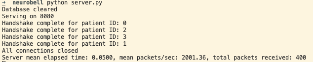
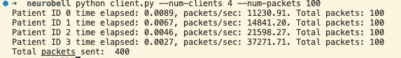

# How to run

1. `docker-compose up` - start the database
2. `python server.py` - start the server
3. `python client.py --num-clients 10 --num-packets 10000` start 10 virtual clients and have each of them sent 10000 data packets

